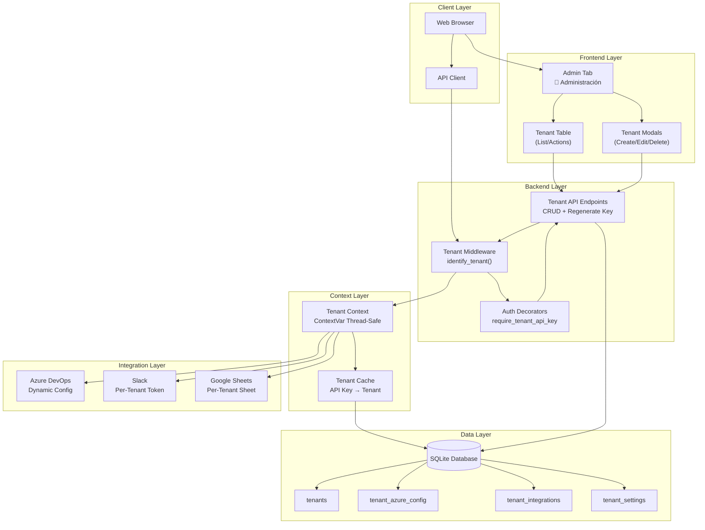
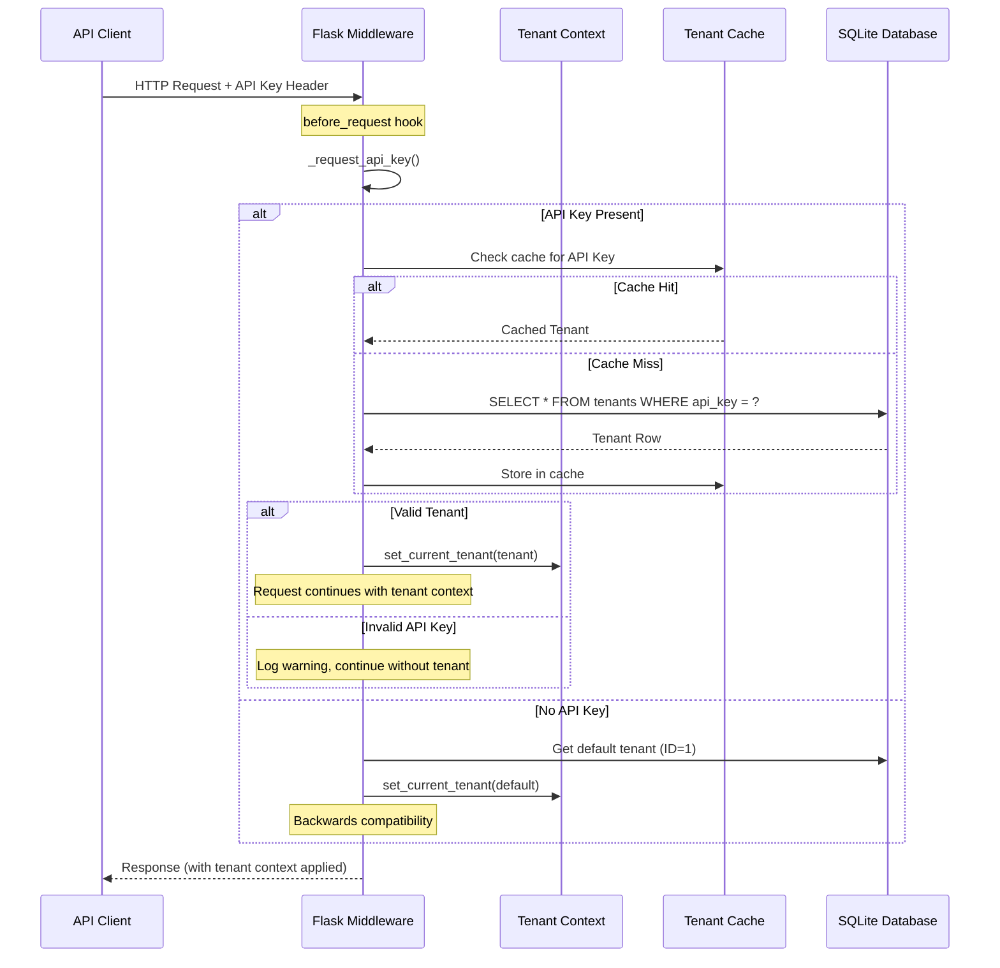
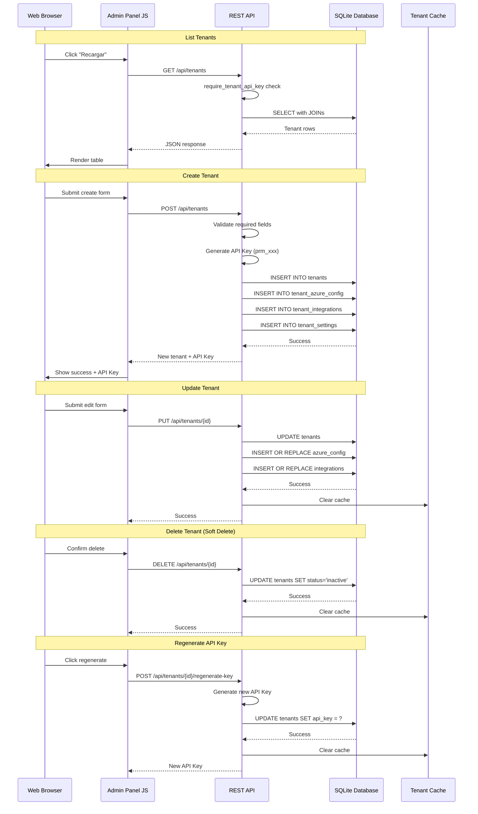

# Design Document: Tenant Administration System

## Overview

The Tenant Administration System provides a complete multi-tenant architecture for the PR Dashboard application, enabling multiple organizations to use the platform with isolated configurations, integrations, and data. The system manages tenant identification via API Keys, context-aware request handling, and administrative interfaces for tenant lifecycle management.

The system is already implemented and functional, with a SQLite database backend, Flask middleware for tenant identification, and a complete frontend administration panel. This document describes the current architecture and provides guidance for future enhancements.

## Architecture

### High-Level Architecture



### Tenant Identification Flow



### Tenant CRUD Operations Flow



## Components and Interfaces

### Component 1: Tenant Middleware

**Purpose**: Identifies and establishes tenant context for every HTTP request.

**Interface**:
```python
@app.before_request
def identify_tenant() -> None:
    """
    Identifica el tenant antes de cada petición HTTP.
    El tenant se identifica por la API Key en los headers.
    
    - Extrae API Key via _request_api_key()
    - Busca tenant por API Key via get_tenant_by_api_key()
    - Establece tenant en contexto via set_current_tenant()
    - Fallback a tenant por defecto (ID=1) si no hay API Key
    """

def _request_api_key() -> Optional[str]:
    """
    Extrae la API Key de la petición HTTP.
    
    Busca en orden:
    1. Authorization: Bearer <api_key>
    2. X-API-Key header
    3. api_key query parameter
    
    Returns:
        API Key string o None
    """
```

**Responsibilities**:
- Extract API Key from request headers (Authorization Bearer, X-API-Key, or query param)
- Look up tenant by API Key with caching
- Set tenant in thread-safe context variable
- Handle missing/invalid API Keys gracefully
- Maintain backwards compatibility with default tenant

### Component 2: Authentication Decorators

**Purpose**: Protects endpoints with API Key validation.

**Interface**:
```python
def require_api_key(f: Callable) -> Callable:
    """
    Decorator que requiere la API_KEY global del servidor.
    Usado para endpoints administrativos heredados.
    
    Returns 401 si la API Key no coincide.
    Returns 503 si API_KEY no está configurada.
    """

def require_tenant_api_key(f: Callable) -> Callable:
    """
    Decorator que requiere una API Key válida de tenant.
    
    - Extrae API Key de la petición
    - Valida que exista el tenant
    - Establece el tenant en contexto
    
    Returns 401 si API Key es inválida o faltante.
    """
```

**Responsibilities**:
- Validate API Key presence and format
- Verify tenant exists and is active
- Set tenant context for request duration
- Return appropriate HTTP error codes

### Component 3: Tenant Context Manager

**Purpose**: Manages thread-safe tenant context and caching.

**Interface**:
```python
class Tenant:
    """
    Representa un tenant (cliente) con toda su configuración.
    
    Attributes:
        id: Tenant ID único
        subdomain: Subdominio del tenant
        company_name: Nombre de la empresa
        api_key: API Key del tenant
        plan: Plan de suscripción (basic, pro, enterprise)
        status: Estado (active, inactive)
    
    Properties (lazy loading):
        azure_config: Dict con org_url, project, repository, pat_token
        integrations: Dict de integraciones por tipo
        settings: Dict con language, timezone, blocked_*, etc.
    """
    
    def get_integration(self, integration_type: str) -> Optional[Dict]:
        """Obtiene una integración específica por tipo."""
    
    def has_integration(self, integration_type: str) -> bool:
        """Verifica si el tenant tiene una integración habilitada."""

def get_tenant_by_api_key(api_key: str) -> Optional[Tenant]:
    """Obtiene un tenant por su API Key (con cache)."""

def get_tenant_by_id(tenant_id: int) -> Optional[Tenant]:
    """Obtiene un tenant por su ID."""

def set_current_tenant(tenant: Tenant) -> None:
    """Establece el tenant actual en el contexto thread-safe."""

def get_current_tenant() -> Optional[Tenant]:
    """Obtiene el tenant actual del contexto."""

def clear_tenant_cache() -> None:
    """Limpia el cache de tenants."""
```

**Responsibilities**:
- Provide thread-safe tenant storage using ContextVar
- Cache tenant lookups by API Key for performance
- Lazy-load tenant configurations (azure, integrations, settings)
- Support multi-threaded Flask requests

### Component 4: Tenant REST API

**Purpose**: Provides CRUD operations for tenant management.

**Interface**:
```python
# GET /api/tenants - List all tenants
@app.route("/api/tenants", methods=["GET"])
@require_tenant_api_key
def list_tenants() -> Response:
    """
    Lista todos los tenants activos con su configuración.
    
    Returns:
        {
            "ok": true,
            "tenants": [{
                "id": int,
                "subdomain": str,
                "company_name": str,
                "api_key": str,
                "plan": str,
                "status": str,
                "created_at": str,
                "azure_config": {...},
                "active_integrations": int
            }]
        }
    """

# POST /api/tenants - Create new tenant
@app.route("/api/tenants", methods=["POST"])
@require_tenant_api_key
def create_tenant() -> Response:
    """
    Crea un nuevo tenant con configuración inicial.
    
    Request Body:
        {
            "subdomain": str (required),
            "company_name": str (required),
            "plan": "basic"|"pro"|"enterprise" (required),
            "azure_config": {
                "org_url": str,
                "project": str,
                "repository": str,
                "pat_token": str (optional)
            },
            "integrations": {
                "slack": {"enabled": bool, "config": {...}},
                "sheets": {"enabled": bool, "config": {...}}
            }
        }
    
    Returns:
        {
            "ok": true,
            "tenant": {
                "id": int,
                "api_key": str (auto-generated),
                ...
            }
        }
    """

# PUT /api/tenants/{id} - Update tenant
@app.route("/api/tenants/<int:tenant_id>", methods=["PUT"])
@require_tenant_api_key
def update_tenant(tenant_id: int) -> Response:
    """
    Actualiza un tenant existente.
    
    Request Body:
        {
            "company_name": str,
            "plan": str,
            "status": "active"|"inactive",
            "azure_config": {...},
            "integrations": {...}
        }
    """

# DELETE /api/tenants/{id} - Soft delete tenant
@app.route("/api/tenants/<int:tenant_id>", methods=["DELETE"])
@require_tenant_api_key
def delete_tenant(tenant_id: int) -> Response:
    """
    Elimina un tenant (soft delete).
    Cambia status a 'inactive'.
    """

# POST /api/tenants/{id}/regenerate-key - Regenerate API Key
@app.route("/api/tenants/<int:tenant_id>/regenerate-key", methods=["POST"])
@require_tenant_api_key
def regenerate_tenant_key(tenant_id: int) -> Response:
    """
    Regenera la API Key de un tenant.
    
    Returns:
        {"ok": true, "api_key": "prm_xxx"}
    """
```

**Responsibilities**:
- Validate tenant data (required fields, valid plans)
- Generate secure unique API Keys
- Handle database transactions atomically
- Return appropriate HTTP status codes
- Clear tenant cache on updates

### Component 5: Frontend Administration Panel

**Purpose**: Provides user interface for tenant management.

**Interface**:
```javascript
// Data
let allTenants = [];

// API Functions
async function loadTenants(): Promise<void>
function renderTenantsPanel(): void

// Modal Functions
function openCreateTenantModal(): void
function closeCreateTenantModal(): void
async function submitCreateTenant(): Promise<void>

function openEditTenantModal(tenantId: number): void
function closeEditTenantModal(): void
async function submitEditTenant(): Promise<void>

async function regenerateApiKey(): Promise<void>
async function deleteTenant(tenantId: number): Promise<void>

// Helpers
function apiHeaders(extra = {}): object
```

**Responsibilities**:
- Display tenant list in sortable table
- Show KPIs (total, active, enterprise, integrations)
- Provide create/edit/delete modals
- Handle form validation and submission
- Display API Key on creation (one-time display)
- Support API Key regeneration
- Handle error states gracefully

## Data Models

### Tenant

```sql
CREATE TABLE tenants (
    id INTEGER PRIMARY KEY AUTOINCREMENT,
    subdomain TEXT UNIQUE NOT NULL,
    company_name TEXT NOT NULL,
    api_key TEXT UNIQUE NOT NULL,
    plan TEXT NOT NULL CHECK(plan IN ('basic', 'pro', 'enterprise')),
    status TEXT NOT NULL DEFAULT 'active' CHECK(status IN ('active', 'inactive')),
    created_at TEXT NOT NULL DEFAULT (datetime('now')),
    updated_at TEXT NOT NULL DEFAULT (datetime('now'))
);
```

**Validation Rules**:
- `subdomain`: Lowercase, alphanumeric with hyphens, unique, required
- `company_name`: Non-empty string, required
- `api_key`: Auto-generated, format `prm_{43 random chars}`, unique
- `plan`: One of `basic`, `pro`, `enterprise`
- `status`: One of `active`, `inactive`

### Azure DevOps Configuration

```sql
CREATE TABLE tenant_azure_config (
    tenant_id INTEGER PRIMARY KEY,
    org_url TEXT NOT NULL,
    project TEXT NOT NULL,
    repository TEXT NOT NULL,
    pat_token TEXT,
    FOREIGN KEY (tenant_id) REFERENCES tenants(id) ON DELETE CASCADE
);
```

**Validation Rules**:
- `org_url`: Valid Azure DevOps organization URL
- `project`: Non-empty string
- `repository`: Non-empty string (defaults to project name)
- `pat_token`: Optional, encrypted storage recommended

### Tenant Integrations

```sql
CREATE TABLE tenant_integrations (
    id INTEGER PRIMARY KEY AUTOINCREMENT,
    tenant_id INTEGER NOT NULL,
    integration_type TEXT NOT NULL CHECK(integration_type IN ('slack', 'sheets', 'email', 'webhook')),
    enabled INTEGER NOT NULL DEFAULT 0,
    config TEXT NOT NULL DEFAULT '{}',
    FOREIGN KEY (tenant_id) REFERENCES tenants(id) ON DELETE CASCADE,
    UNIQUE(tenant_id, integration_type)
);
```

**Validation Rules**:
- `integration_type`: One of supported integration types
- `enabled`: 0 or 1 (boolean)
- `config`: Valid JSON object with integration-specific configuration

### Tenant Settings

```sql
CREATE TABLE tenant_settings (
    tenant_id INTEGER PRIMARY KEY,
    language TEXT NOT NULL DEFAULT 'es',
    timezone TEXT NOT NULL DEFAULT 'America/Mexico_City',
    blocked_authors TEXT NOT NULL DEFAULT '[]',
    blocked_branches TEXT NOT NULL DEFAULT '[]',
    local_repo_path TEXT,
    logo_url TEXT,
    primary_color TEXT,
    FOREIGN KEY (tenant_id) REFERENCES tenants(id) ON DELETE CASCADE
);
```

**Validation Rules**:
- `language`: Valid language code (e.g., `es`, `en`)
- `timezone`: Valid timezone identifier
- `blocked_authors`: JSON array of author names
- `blocked_branches`: JSON array of branch patterns
- `primary_color`: Valid hex color code (optional)

## Error Handling

### Error Scenario 1: Invalid API Key

**Condition**: Request contains an API Key that doesn't match any active tenant
**Response**: 
- Log warning with truncated API Key
- Continue request without tenant context
- If endpoint requires tenant, return 401 Unauthorized
**Recovery**: None required, request is rejected

### Error Scenario 2: Missing API Key

**Condition**: Request to tenant-specific endpoint without API Key
**Response**: 
- Middleware falls back to default tenant (ID=1)
- If endpoint uses `require_tenant_api_key`, returns 401
**Recovery**: Client must provide valid API Key

### Error Scenario 3: Duplicate Subdomain

**Condition**: Attempt to create tenant with existing subdomain
**Response**: 
- Database constraint violation caught
- Return 409 Conflict with message "El subdominio ya existe"
**Recovery**: Client must choose different subdomain

### Error Scenario 4: Database Error

**Condition**: SQLite operation fails unexpectedly
**Response**: 
- Log error with full stack trace
- Rollback transaction if applicable
- Return 500 Internal Server Error
**Recovery**: Check database connectivity and integrity

### Error Scenario 5: Integration Configuration Error

**Condition**: Tenant has invalid integration configuration
**Response**: 
- Log warning
- Return None/default for integration config
- Integration functions handle gracefully (skip notifications, etc.)
**Recovery**: Admin should update tenant configuration

## Testing Strategy

### Unit Testing Approach

**Core Components to Test**:
1. `_request_api_key()` - API Key extraction from various sources
2. `get_tenant_by_api_key()` - Cache hit/miss scenarios
3. `Tenant` lazy loading properties
4. API Key generation uniqueness
5. Validation functions for tenant data

**Coverage Goals**:
- 90%+ coverage on tenant_context.py
- 85%+ coverage on tenant middleware
- All error paths tested

### Property-Based Testing Approach

**Properties to Test**:
1. API Key generation uniqueness
2. Tenant cache consistency
3. Round-trip tenant creation and retrieval
4. Context isolation between requests

**Property Test Library**: hypothesis (Python)

### Integration Testing Approach

**Scenarios to Test**:
1. Full tenant lifecycle (create → read → update → delete)
2. API Key regeneration invalidates old key
3. Tenant context propagation to integrations
4. Concurrent request handling with different tenants

## Performance Considerations

### Current Implementation

1. **Tenant Cache**: In-memory dictionary cache by API Key reduces database lookups
2. **Lazy Loading**: Tenant configurations loaded on-demand, not on every request
3. **Thread-Safe Context**: ContextVar provides O(1) access to current tenant
4. **Database Indexing**: API Key column has UNIQUE constraint (implicit index)

### Performance Metrics

- Tenant lookup with cache hit: < 1ms
- Tenant lookup with cache miss: ~5-10ms (SQLite query)
- Context retrieval: < 0.1ms (ContextVar get)
- Cache memory per tenant: ~2KB

### Scalability Limits

- Current: Suitable for hundreds of tenants
- Cache grows linearly with active tenants
- SQLite concurrent writes limited
- Single-process Flask deployment

### Optimization Opportunities

1. **Cache Eviction**: Implement LRU cache with TTL for long-running processes
2. **Database Connection Pooling**: Use connection pool for high concurrency
3. **Read Replicas**: Offload tenant lookups to read replica if scaling
4. **Redis Cache**: Move tenant cache to Redis for multi-process/multi-server deployment

## Security Considerations

### Authentication

1. **API Key Format**: Uses cryptographically secure random token generation (`secrets.token_urlsafe(32)`)
2. **API Key Prefix**: `prm_` prefix helps identify tenant API Keys vs other tokens
3. **Key Length**: 43 characters of entropy (256 bits), providing strong security

### Authorization

1. **Endpoint Protection**: All tenant management endpoints require valid tenant API Key
2. **Tenant Isolation**: Each tenant's data isolated by tenant_id foreign keys
3. **Soft Delete**: Deleting tenant preserves data for audit/recovery

### Data Protection

1. **PAT Tokens**: Azure DevOps PAT tokens stored in plain text (recommendation: encrypt at rest)
2. **API Key Display**: API Key shown only once on creation
3. **No Passwords**: System uses API Keys, not passwords

### Recommendations

1. **Encrypt Sensitive Data**: Encrypt PAT tokens and Slack tokens at rest
2. **Rate Limiting**: Implement rate limiting on tenant API endpoints
3. **Audit Logging**: Log all tenant modifications with user/IP
4. **API Key Rotation**: Encourage regular API Key rotation
5. **IP Allowlisting**: Consider IP restrictions for enterprise tenants

## Dependencies

### Python Packages

- `flask`: Web framework for REST API and middleware
- `sqlite3`: Database driver (built-in)
- `secrets`: Cryptographically secure random generation (built-in)
- `threading`: Thread-safe cache management (built-in)
- `contextvars`: Thread-safe context storage (built-in, Python 3.7+)

### External Services

- **Azure DevOps**: Version control and PR management
- **Slack**: Notification delivery
- **Google Sheets**: Export functionality

### Configuration

- Environment variables:
  - `API_KEY`: Global server API Key for legacy endpoints
  - `HOST`, `PORT`, `DEBUG`: Server configuration
- Database path: `memoria/state.db`

### Browser Requirements

- Modern browser with JavaScript enabled
- ES6+ support for frontend functionality
